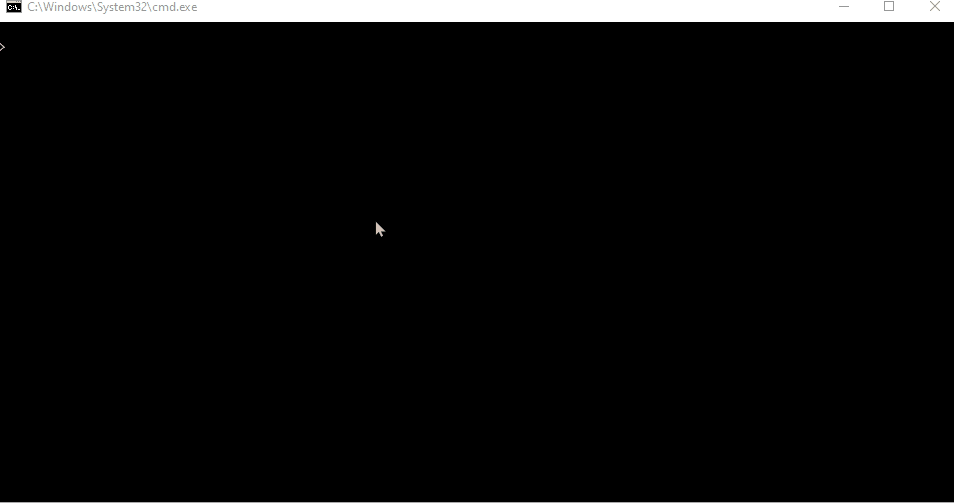
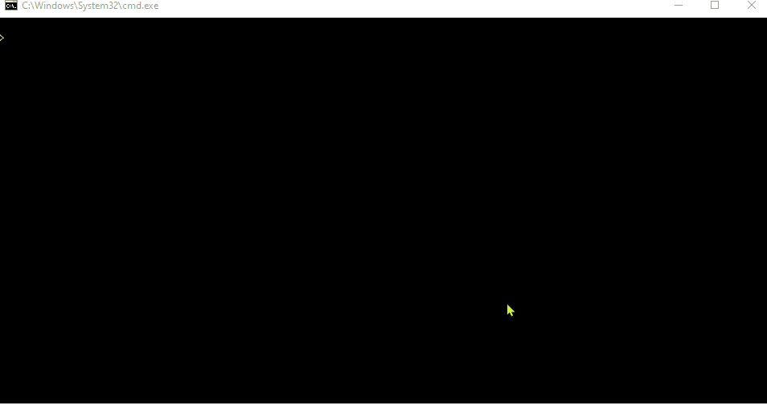
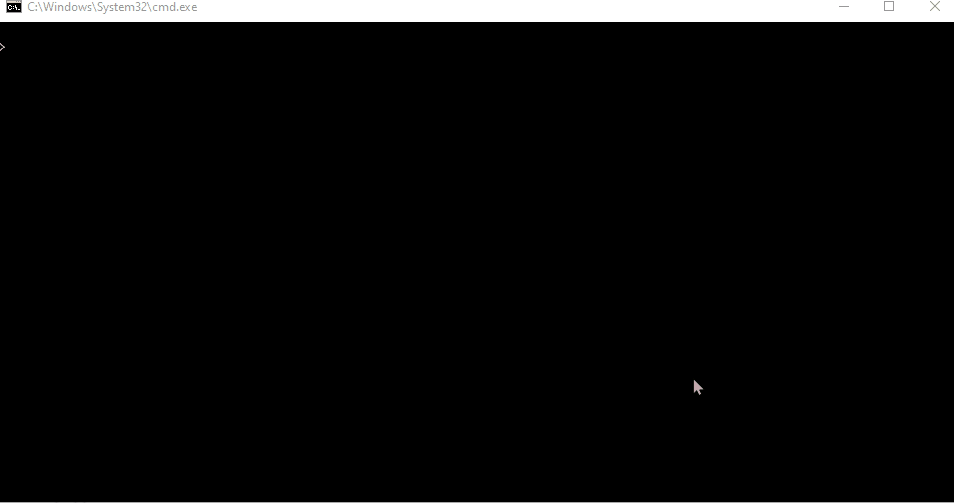

# Restricted Transportation

In this project we want to move multiple animals from zoo A to zoo B. Our transportation vehicle is limited by the weight it can carry. The goal is to carry all the animals from A to B with the minimum transportation required given the limit carriable weight of the vehicle.

The following shows the name of the animals and their weights:

|Name|			Weight|
|:--:|			:--: |
|Maggie :monkey: |	3|
|Herman :orangutan: |	7|
|Betsy :lion: |		9|
|Oreo :horse: |		6|
|Moo Moo :cow2: |	3|
|Milkshake :ox: |	2|
|Millie :zebra: |	5|
|Lola :dog2: |		2|
|Florence :wolf: |	2|
|Henrietta :bison: |	9|

# Code in Action

Here we can see the final result of the implementation.

## Greedy

The following shows the result when we use greedy algorithm:

## Brute Force

The following shows the result when we use brute-force algorithm:

## Differential Time

The following shows the calculation time required for each algorithm:

